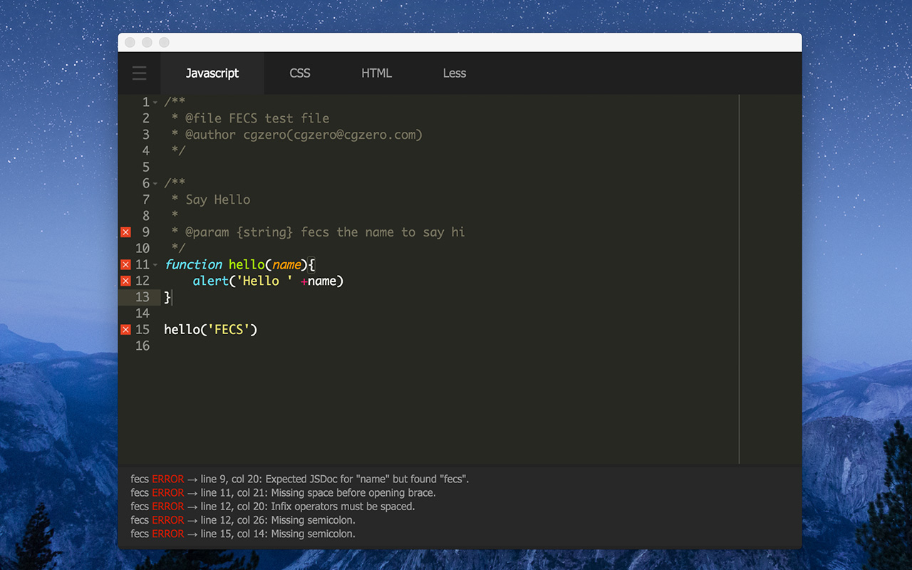

# FECS Editor

使用FECS帮助你快速检查、格式化代码的编辑器。[点此下载](https://chrome.google.com/webstore/detail/jinjgfophhifgdfocpdlbgklblcmkffp)

## 更新历史

- 1.3 图标增加阴影；修复了一些 bug [2015-12-17]
- 1.2 代码提示 icon 优化 [2015-12-16]
- 1.1 图标支持视网膜屏 [2015-12-16]
- 1.0 新版本发布 [2015-12-16]
